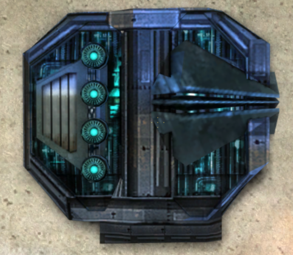

# How to play

SpageAge is Spacebuild with Mining and levelling.

I would recommend looking at [https://steamcommunity.com/sharedfiles/filedetails/?id=129010634](https://steamcommunity.com/sharedfiles/filedetails/?id=129010634) to get an introduction to Spacebuild.

## SpaceAge

Getting around, The main spawn planet is used for creating your Miners/Ships and you will spawn on here if your not a part of any [Faction](factions.md).

On several planets there are teleporters that will allow you to travel to other planets.

- Green = Can teleport
- Blue = Planet your on
- Red = No teleporter (Can't travel to these via teleporter)

## Mining

Under the CAF section in the "Q"/F1 menu you will see a section labelled as SpaceAge, this is where you get all the components to start mining once you have a basic ship from SpaceBuild.

### Ore

You will need:
- Asteroid Mining Laser(s) from Mining (1 at Advance Level 1)
- Ore Container(s) from Mining Storage (up to 4)
- *(optional)* The Mining Scanner - this will output data from the asteroid it is pointing at

### Tiberium

**Warning:** This will kill you at least once. Tiberium is an extremely dangerous material and will break down most materials, including you and your SHIP if you get too close

You will need:
- Tiberium Mining Drill(s) from Mining (1 at Advance Level 1)
- Tiberium Container(s) from Mining Storage (upto 4)
- *(optional)* Tiberium Holder from Entities->Other (this is to allow for quick empty so you don't have to weld/unweld every time)

### ICE

To **mine** ICE you will need:
- ICE Laser(s) from Mining (1 at Advance Level 1)
- ICE Storage(s) from Mining Storage (upto 4)

To **refine** ICE you will need:
- ICE Refinery(s) from Mining (1 at Advance Level 1)
- ICE Storage(s) from Mining Storage (upto 4 - Shared with ICE Product Storage)
- ICE Product Storage(s) from Mining Storage (upto 4 - ICE Storage)

It is possible to do both of these at the same time but not recommended until at least Advance Level 3.

- Laser levels
  1. 60 seconds per cycle
  2. 45
  3. 30

- Refinery levels
  1. 20 seconds per cycle
  2. 15 
  3. 10

### Automining

[Check rules here](rules.md)

### Terminal (Selling product)

TBC Terminal/Refinaing/more detail on automining/upgrades and Advance level/more info on mining

*Originally written by: Scotty*
